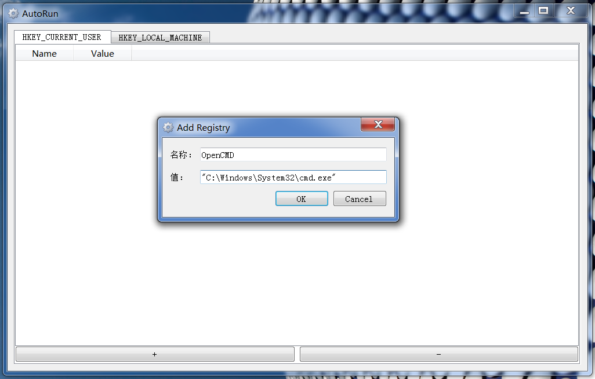
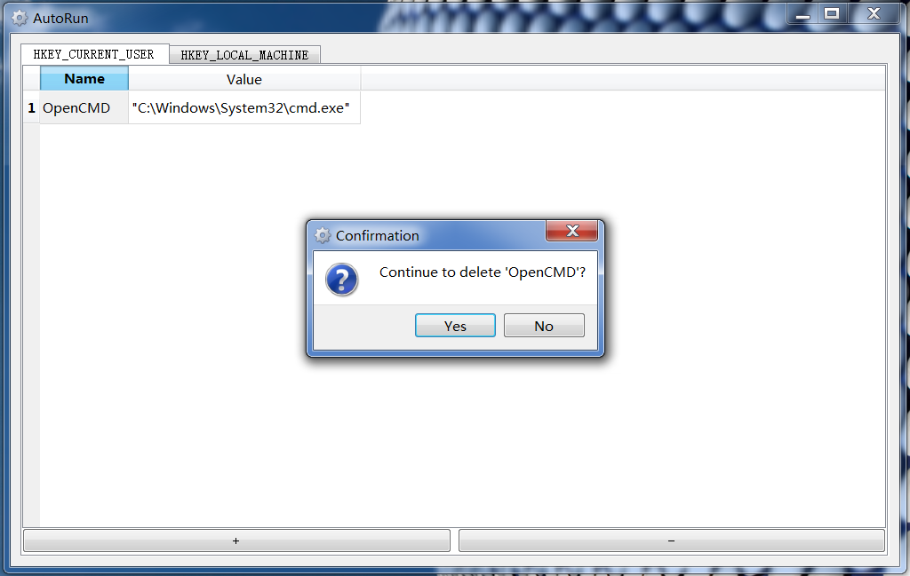

# AutoRun

[中文](../ReadMe.md) | ENG

To edit Automatic Startup on Windows，where two ROOTs included：

+ current user: `HKEY_CURRENT_USER`
+ system: `HKEY_LOCAL_MACHINE`（Require Administrator Permission）

# Interface

### 1. add registry

### 2. delete registry

